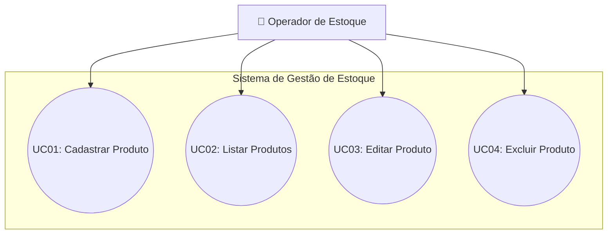

# Sistema de Gestão de Estoque (CRUD PHP)

Este projeto é uma aplicação web para gerenciamento de estoque de produtos, desenvolvida para permitir o controle eficiente de entradas, edições, consultas e remoções de itens no banco de dados.

## 🎯 Objetivo do Sistema

O objetivo principal da aplicação é fornecer uma interface simples e segura para o gerenciamento de produtos em estoque, garantindo a integridade dos dados e a segurança contra vulnerabilidades comuns em aplicações web, como **SQL Injection**, utilizando **Prepared Statements** (Instruções Preparadas) da extensão MySQLi.

---

## 🛠️ Tecnologias Utilizadas

- **Linguagem Server-Side:** PHP 8.x
- **Banco de Dados:** MySQL / MariaDB
- **Driver de Conexão:** MySQLi com Prepared Statements (`mysqli_stmt`)
- **Front-End:** HTML5 e CSS3
- **Servidor Local Recomendado:** XAMPP, WAMP, Laragon ou Docker (Apache + MySQL)

---

## 💻 Requisitos para Execução

- Web Server com suporte a **PHP 7.4** ou superior.
- SGBD **MySQL** ou **MariaDB**.
- Navegador Web moderno (Chrome, Firefox, Edge).

---

## 🚀 Instruções de Instalação e Configuração

1. **Clonar ou Baixar o Repositório:**
   Coloque a pasta do projeto dentro do diretório público do seu servidor web (ex: `htdocs` no XAMPP ou `www` no WAMP).

2. **Configuração do Banco de Dados:**
   - Inicie o serviço do MySQL no seu servidor local.
   - Acesse o gerenciador do banco de dados (ex: phpMyAdmin).
   - Importe ou execute o script SQL localizado em `database/db.sql`.
   
   *(O script criará o banco de dados `estoque` e a tabela `produto`).*

3. **Configuração da Conexão:**
   - Abra o arquivo `infra/connection.php` e ajuste as credenciais de acesso se necessário:
     ```php
     $conn = new mysqli("localhost", "root", "", "estoque");
     ```

4. **Acessar a Aplicação:**
   - Abra o navegador e navegue até a URL local do projeto:
     ```text
     http://localhost/nome-da-sua-pasta/index.php
     ```

---

## 🗄️ Estrutura do Banco de Dados

### Tabela: `produto`

| Campo | Tipo | Nulo | Chave | Descrição |
| :--- | :--- | :--- | :--- | :--- |
| `id` | `INT` | Não | Primary (Auto Increment) | Identificador único do produto |
| `nome` | `VARCHAR(255)` | Não | - | Nome do produto |
| `categori` | `VARCHAR(255)` | Não | - | Categoria do produto |
| `descricao` | `VARCHAR(255)` | Não | - | Descrição/detalhes do produto |
| `preco` | `DECIMAL(10,2)` | Não | - | Valor unitário do produto |
| `estoque` | `INT` | Não | - | Quantidade de itens em estoque |
| `data_validade`| `DATE` | Não | - | Data de validade do produto |

---

## ⚙️ Explicação das Principais Funcionalidades

1. **Listagem de Produtos (`index.php`):**
   - Executa uma consulta no banco de dados e apresenta todos os produtos cadastrados em uma tabela organizada.
   - Formata a exibição de dados e fornece links diretos para alteração e exclusão.

2. **Cadastro de Produtos (`public/cadastrar.php`):**
   - Recebe as informações enviadas via formulário POST na página principal.
   - Converte vírgulas monetárias em pontos (`str_replace`) para persistência decimal correta.
   - Insere os dados utilizando `prepare()` e `bind_param("sssdis", ...)` para evitar SQL Injection.

3. **Edição de Produto (`public/editar.php` e `public/atualizar.php`):**
   - **`editar.php`**: Resgata os dados do produto selecionado pelo ID (via `GET`) com Prepared Statement e preenche previamente os campos do formulário.
   - **`atualizar.php`**: Recebe os dados alterados via POST e executa uma query `UPDATE` parametrizada para atualizar o registro.

4. **Exclusão de Produto (`public/excluir.php`):**
   - Recebe o ID do produto via parâmetro `GET`.
   - Executa a exclusão segura do registro utilizando `DELETE FROM produto WHERE id = ?`.

---

## 📁 Estrutura de Pastas do Projeto

```text
├── database/
│   └── db.sql
├── infra/
│   └── connection.php
├── public/
│   ├── atualizar.php
│   ├── cadastrar.php
│   ├── editar.php
│   └── excluir.php
├── style/
│   └── style.css
├── index.php
├── CASOS_DE_USO.md
└── README.md
```

# Documentação de Casos de Uso

Este documento descreve os atores e os casos de uso do **Sistema de Gestão de Estoque**.

---

## 👤 Atores

### 1. Operador de Estoque / Administrador
- **Descrição:** Usuário responsável por gerenciar o inventário de produtos no sistema.
- **Permissões:** Acesso total para visualizar, cadastrar, alterar e remover produtos do estoque.

---

## 📋 Relação de Casos de Uso

| ID | Caso de Uso | Descrição |
| :--- | :--- | :--- |
| **UC01** | Cadastrar Produto | Permite a inclusão de um novo produto no banco de dados. |
| **UC02** | Consultar/Listar Produtos | Exibe todos os produtos cadastrados e suas informações na tela principal. |
| **UC03** | Editar Produto | Permite a alteração das informações de um produto existente. |
| **UC04** | Excluir Produto | Permite a remoção permanente de um produto do estoque. |

---

## 📑 Detalhamento dos Casos de Uso

### **UC01: Cadastrar Produto**
- **Ator Principal:** Operador de Estoque.
- **Pré-condições:** O sistema deve estar operacional e o banco de dados acessível.
- **Fluxo Principal:**
  1. O operador acessa a página principal (`index.php`).
  2. Preenche os campos do formulário: Nome, Categoria, Descrição, Preço, Estoque e Data de Validade.
  3. Clica no botão "Cadastrar produto".
  4. O sistema valida os dados enviados via `POST`, executa o `INSERT` com Prepared Statement e redireciona para a listagem atualizada.

---

### **UC02: Consultar/Listar Produtos**
- **Ator Principal:** Operador de Estoque.
- **Pré-condições:** Nenhuma.
- **Fluxo Principal:**
  1. O operador acessa a URL base do sistema.
  2. O sistema executa a consulta `SELECT` e monta a tabela HTML com os registros encontrados.

---

### **UC03: Editar Produto**
- **Ator Principal:** Operador de Estoque.
- **Pré-condições:** O produto a ser editado deve estar cadastrado no banco de dados.
- **Fluxo Principal:**
  1. O operador clica no link "Editar" correspondente ao produto desejado na tabela de produtos.
  2. O sistema carrega a tela `editar.php`, busca as informações do produto via ID (`GET`) e preenche o formulário.
  3. O operador realiza as modificações necessárias e clica em "Editar produto".
  4. O sistema processa os novos dados em `atualizar.php`, salva as alterações com `UPDATE` e redireciona para `index.php`.

---

### **UC04: Excluir Produto**
- **Ator Principal:** Operador de Estoque.
- **Pré-condições:** O produto a ser excluído deve estar cadastrado.
- **Fluxo Principal:**
  1. O operador clica no link "Excluir" relativo ao produto desejado.
  2. O sistema aciona a página `excluir.php` passando o ID via `GET`.
  3. O sistema executa o comando `DELETE` com Prepared Statement e atualiza a listagem.

---

## 📊 Diagrama de Casos de Uso (UML)

O diagrama a seguir representa graficamente as interações do ator com os casos de uso do sistema.

